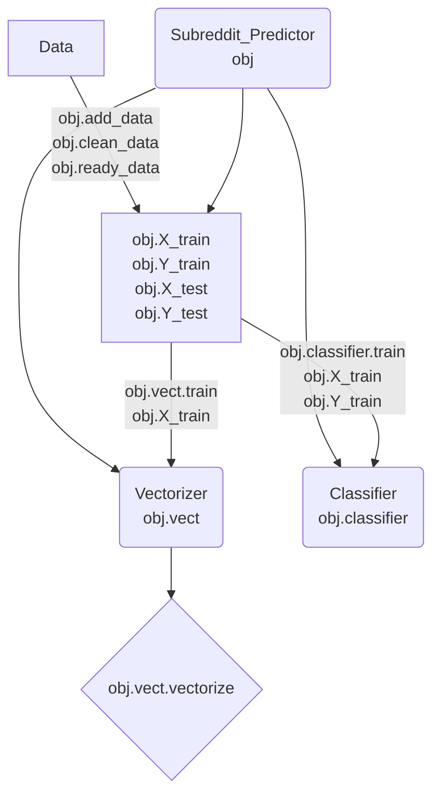

# Reddit Projects
 A collection of projects focused on analyzing Reddit data

Here is a simple flow chart:

```mermaid
graph TD;
    Obj(Subreddit_Predictor <br/> obj)-->Vect(Vectorizer <br/> obj.vect);
    Obj-->Class(Classifier <br/> obj.classifier);
    Raw[Data]-->|obj.add_data <br/> obj.clean_data <br/> obj.ready_data| Data[obj.X_train <br/> obj.Y_train <br/> obj.X_test <br/> obj.Y_test];
    Obj-->Data;
    Data --> |obj.vect.train <br/> obj.X_train| Vect;
    Vect --> Vectorize{obj.vect.vectorize};
    Data --> |obj.classifier.train <br/> obj.X_train <br/> obj.Y_train| Class;
```
